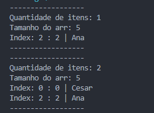

<h1>README: Tabela Hash em Java</h1>
<h2>Visão Geral</h2>

Este é um projeto de implementação de uma Tabela Hash em Java utilizando diversos métodos de inserção e tratamento de colisões. A Tabela Hash é uma estrutura de dados em que você armazena os dados em formas de pares de chaves e valores. A chave, que é usada para identificar os dados, é dada como uma entrada para a função de hashing.

<h2>Imagem exemplo de uma Tabela Hash<h2>
</img>

<h2>Funcionalidades</h2>
<h3>O projeto inclui as seguintes funcionalidades:</h3>
<ul>
<li>Inserção de um Elemento: Permite a inserção de um elemento na Tabela</li>

<li>Remoção de um Elemento: Permite a remoção de um elemento da Tabela.</li>

<li>Busca de um Elemento: Permite buscar um elemento na Tabela utilizando a sua chave como referência.</li>

<li>Impressão da Tabela: Permite imprimir a Tabela de forma visual e todos os seus dados na posição correta.</li>

<li>Medição de eficiência: </li>
</ul>

<h2>Pré-requisitos</h2>

Antes de executar o projeto, certifique-se de ter o Java JDK (Java Development Kit) instalado em seu sistema.

<h1>Exemplo de Uso</h1>

Aqui está alguns exemplos de como usar a Tabela Hash em Java:

<h3>Inserir<h3>
</img>
<h3>Remoção<h3>
</img>
<h3>Busca<h3>
</img>
<h3>Medição de Eficiência<h3>
</img>

<h1>Autores<h1>
<ul>
<li>César Willian</li>
<li>Otávio Carneiro</li>
<li>Rodrigo Munch</li>
<ul>
